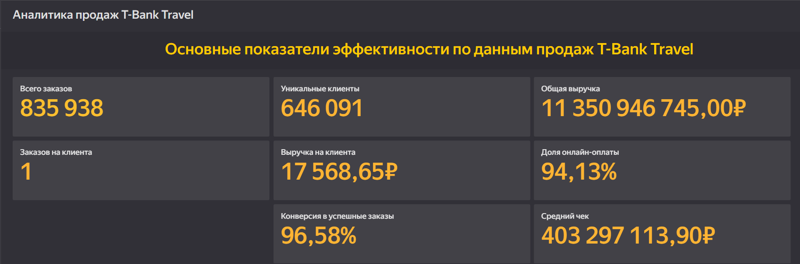
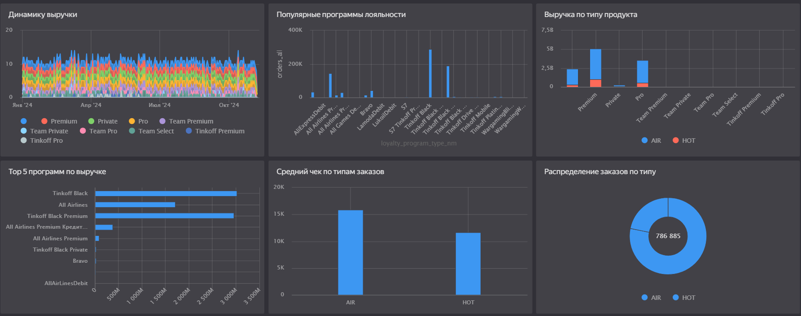

# 🏦 T-Bank: Analysis of Hotels and Air Travel Bookings

**Цель проекта:** исследовать данные о бронировании отелей и авиаперелётов клиентов T-Bank, выявить закономерности и сегменты пользователей для повышения эффективности предложений.

---

## 📊 Ключевые задачи
- Провести разведочный анализ (EDA) транзакций клиентов в категории *travel*  
- Определить пики активности и сезонность бронирований  
- Сегментировать клиентов по типу поездок (личные / рабочие)  
- Выявить наиболее прибыльные направления и категории  
- Подготовить визуализации и BI-дашборд с основными метриками

---

## ⚙️ Используемый стек
`Python` · `Pandas` · `Matplotlib` · `Seaborn` · `DataLens` · `SQL`  

---

## 📂 Структура репозитория
T-bank_analysis_hotels_and_air_travel/

├── data/ # данные и SQL запросы

├── notebooks/ # ноутбуки с анализом

├── dashboards/ # визуализации, BI-дашборды

├── src/                   # исходный код (Python-скрипты)

│   └── main.py            # основной скрипт

├── presentation/ # презентация проекта

├── docs/

│      ├── tbank_report.html  # HTML-презентация [Смотреть сайт](https://kor4yz.github.io/T-bank_analysis_hotels_and_air_travel/)

│      ├── png, svg           # PNG / SVG графики

│      └── csv                # CSV

├── results/ # финальные графики, инсайты

└── README.md

---

## 🔍 Основные шаги анализа
1. Загрузка и очистка данных (дубликаты, пропуски, типы)  
2. EDA: категории транзакций, сезонность, география, суммы, количество клиентов  
3. Сегментация: по возрасту, лояльности, типу бронирований  
4. Визуализация трендов и корреляций  
5. Формулировка гипотез:  
   - Пользователи, часто летающие, активнее бронируют отели;  
   - Молодая аудитория чаще бронирует авиабилеты в последний момент;  
6. BI-дашборд для визуального анализа

---

## 📈 Примеры визуализаций

| Метрика | Описание |
|----------|-----------|
| 📅 Seasonality Heatmap | Частота бронирований по месяцам |
| 💸 Revenue by Category | Доход по видам поездок |
| ✈️ Top 10 Destinations | Популярные направления |

## 🖼️ Дашборды (превью)

  
  

---

## 📊 BI-дашборд

🔗 **Yandex DataLens:** [Смотреть дашборд](https://datalens.yandex/1b40fflhydq4m)

---

## 🧩 Основные выводы
- Самый высокий средний чек у клиентов, бронирующих авиабилеты за 30+ дней;  
- 25–34 лет — самая активная аудитория в категории travel;  
- Пики бронирований — июнь и декабрь;  
- Потенциал для персонализированных предложений и cashback-кампаний.

---

## 📬 Автор
**Денис Морозов**  
📧 Kor4yz@yandex.ru · [GitHub](https://github.com/Kor4yz) · [Telegram](https://t.me/kor4yz)
